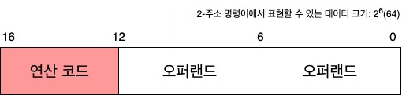
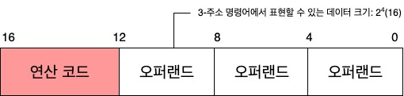
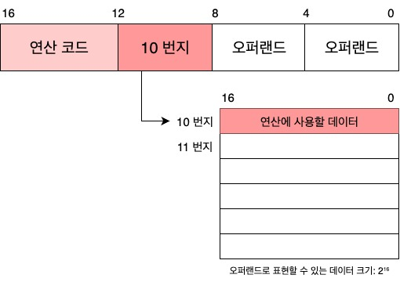
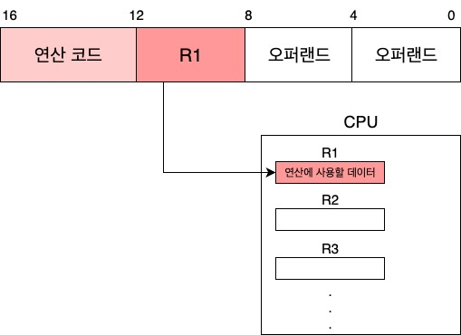
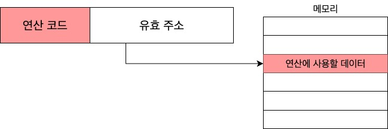
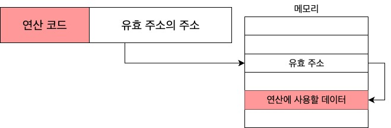
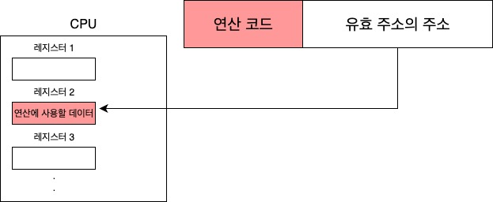
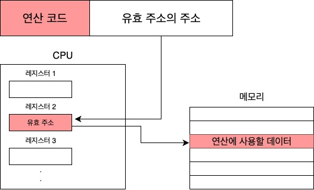
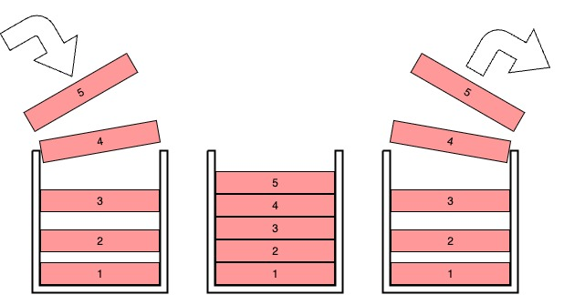
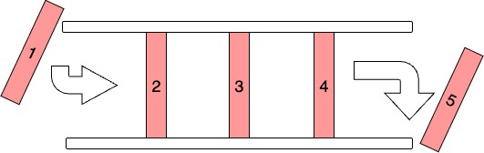

# 🖥️ Instruction

 

## 고급 언어와 저급 언어
### 고급 언어
- 프로그램을 만들 때 **사람이 이해하고 작성하기 쉽게 만들어진 언어**.
- **C, JAVA, Python 등**과 같은 우리가 아는 대부분의 프로그래밍 언어는 **고급 언어**이다.  

### 저급 언어
- **컴퓨터가 직접 이해하고 실행할 수 있는 언어**.
- 고급 언어로 작성된 소스 코드가 실행 되려면 반드시 저급 언어로 **변환되어야** 한다.
- 즉 **저급 언어의 의미는 하드웨어에 가까운 "근원적"** 이라는 뜻.
    
    #### 저급 언어의 종류  
    ##### 기계어(machine code)
    - 0과 1의 명령어 비트로 이루어진 언어
    - 2진수로 나열하면 가독성이 떨어져 16진수로 표현하기도 한다.   
        

        
 리눅스 환경 x86 아키텍처를 이용한 hello world 기계어 코드
        

        > 7F 45 4C 46 01 01 01 00 00 00 00 00 00 00 00 00 02 00 03 00 01 00 00 00 35 40 B3 04 2C 00 00 00 00 00 00 00 00 00 00 00 34 00 20 00 01 00 00 00 00 00 00 00 00 40 B3 04 B2 0C EB 1C 62 00 00 00 62 00 00 00 05 00 00 00 00 10 00 00 48 65 6C 6C 6F 20 77 6F 72 6C 64 0A B9 4C 40 B3 04 93 CD 80 EB FB

        

    
    ##### 어셈블리어(assembly language)
    - 0과 1로 표현된 명령어를 **읽기 편한 형태로 변역한 언어**.
        

        
 MS-DOS에서의 어셈블리어를 활용한 hello world 출력  
        

        > adosseg  
        &nbsp;.model small  
        &nbsp;.stack 100h  
         
        &nbsp;.data  
        hello_message db 'Hello, world!', 0dh, 0ah, '$'  
         
        &nbsp;.code  
        main proc  
        &nbsp;&nbsp;&nbsp;&nbsp;mov ax, @data  
        &nbsp;&nbsp;&nbsp;&nbsp;mov ds, ax  
        &nbsp;&nbsp;&nbsp;&nbsp;mov ah, 9  
        &nbsp;&nbsp;&nbsp;&nbsp;mov dx, offset hello_message  
        &nbsp;&nbsp;&nbsp;&nbsp;int 21h  
         
        &nbsp;&nbsp;&nbsp;&nbsp;mov ax, 4C00h  
        &nbsp;&nbsp;&nbsp;&nbsp;int 21h  
        main endp  
        end main  

        

 

## 컴파일 언어와 인터프리터 언어
### 컴파일 언어
- **소스 코드 전체가 저급 언어로 변환**되어 실행되는 고급 언어.
- **C언어**가 대표적인 언어이다.
- **코드 전체가 저급 언어로 변환되는 과정을 AOT 컴파일(이하 컴파일)이라고 한다.**
- **컴파일을 수행해 주는 도구**를 **컴파일러(compiler)** 라고 한다.  
    

    
 컴파일 과정 
    

    |고급 언어|→|컴파일|→|저급 언어|
    |:--:|--|:--:|--|:--:|
    |🧾 소스 코드|→|🔄 컴파일러|→|📦 목적 코드|  

    #### 컴파일러가 하는 일
    - **문법적 오류** 검사
    - **실행 가능한 코드**인지 검사
    - **실행에 불필요한 코드는 없는지 검사**
    - **고급 언어에서 저급언어로 컴파일**
    - 소스 코드내 **오류가 발견되면 컴파일 실패**

    

 

### 인터프리터 언어
- 인터프리터에 의해 **소스 코드가 한 줄씩 실행되는 고급 언어.**
- **Python**이 대표적인 언어이다.
- **소스 코드를 한 줄씩 저급 언어로 변환하여 실행해 주는 도구를 인터프리터(interpreter)라고 한다.**
    

    
 인터프리터 특징 
  

    - **소스 코드를 한 줄씩 실행**하기 때문에 N번째 줄에 문법 **오류가 있다고 해도 N-1번째 줄 까지는 올바르게 수행**한다.
    - 한 줄씩 변환하고 실행하기 때문에 **일반적으로 컴파일 언어보다 느리다.**

    

    

## 명령어의 구조
### 연산코드(operation code)와 오퍼랜드(operand) 
- **명령어**는 **연산코드**와 **오퍼랜드**로 구성되어있다.
- **연산코드**는 **명령어가 수행할 연산**으로서 **연산자**라고도 불린다.
- **오퍼랜드**는 **연산에 사용할 데이터가 저장된 위치**로서 **피연산자**라고도 불린다.
    

    
 예시 
 

        push  rbp
        mov   rbp, rsp
        mov   DWORD PTR [rbp-4], 1
        mov   DWORD PTR [rbp-8], 2
        mov   edx, DWORD PTR [rbp-4]
        mov   eax, DWORD PTR [rbp-8]
        add   eax, edx
        mov   DWORD PTR [rbp-12], eax
        mov   eax, 0
        pop   rbp
        ret
    > 상기 코드에서 좌측이 **연산코드** 우측이 **오퍼랜드**이다.

     

    > 위 코드의 구조를 간략히 설명하면 아래와 같다.  

    |연산코드|오퍼랜드||
    |:--:|:--:|:--:|
    |더해라|100과|120을|
    |빼라|메모리 32번지 안의 값과|메모리 33번지 안의 값을|
    |저장해라|10을|메모리 128번지에|  

    
 

    #### 오퍼랜드(operand)
    - **연산에 사용할 데이터** 또는 **연산에 사용할 데이터가 저장된 위치**를 의미한다.
    - **숫자와 문자 등을 나타내는 데이터** 또는 **메모리나 레지스터 주소**가 올라올 수 있다.
    - **대부분의 경우** 데이터가 저장된 위치 즉 **메모리 주소나 레지스터 이름이 담기기 때문에 주소 필드 라고 부르기도 한다.**
    - 오퍼랜드는 명령어 안에 하나도 없을 수도 있고, 한 개만 있을 수도, 여러 개가 있을 수도 있다.
        

        
 예시 
  

        |연산 코드|오퍼랜드||
        |--|--|--|
        |mov|eax, 0|오퍼랜드 2개인 경우(2-주소 명령어)|
        |pop|rbp|오퍼랜드 1개인 경우(1-주소 명령어)|
        |ret||오퍼랜드 없는 경우(0-주소 명령어)|  
        > **오퍼랜드 개수는 콤마(,)로 구분**한다.

        

    #### 연산코드(operation code)
    - **명령어가 수행할 연산을 의미**한다.
    - **명령어의 종류와 생김새는 CPU마다 달라서 연산코드 또한 CPU마다 다르다.**
        

        
 대표적인 연산 코드 종류(참고만) 
  

        |데이터 전송||
        |--|--|
        |MOVE|데이터를 옮겨라|
        |STORE|메모리에 저장해라|
        |LOAD(FETCH)|메모리에서 CPU로 데이터를 가져와라|
        |PUSH|스택에 데이터를 저장해라|
        |POP|스택의 최상단 데이터를 가져와라|

        |산술/논리 연산||
        |--|--|
        |ADD|덧셈을 수행해라|
        |SUBTRACT|뺄셈을 수행해라|
        |MULTIPLY|곱셈을 수행해라|
        |DIVIDE|나눗셈을 수행해라|
        |INCREMENT|오퍼랜드에 1을 더해라|
        |DECREMENT|오퍼랜드에 1을 빼라
        |AND/OR/NOT|AND/OR/NOT 연산을 수행해라|
        |COMPARE|두 개의 숫자 또는 TRUE/FALSE 값을 비교해라 

        |제어 흐름 변경||
        |--|--|
        |JUMP|특정 주소로 실행 순서를 옮겨라|
        |CONDITIONALJUMP|조건에 부합할 때 특정 주소로 실행 순서를 옮겨라|
        |HALT|프로그램의 실행을 멈춰라|
        |CALL|되돌아올 주소를 저장한 채 특정 순서로 실행 순서를 옮겨라|
        |RETURN|CALL을 호출할 때 저장했던 주소로 돌아가라  

        |입출력 제어||
        |--|--|
        |READ(INPUT)|특정 입출력 장치로부터 데이터를 읽어라|
        |WRITE(OUTPUT)|특정 입출력 장치로 데이터를 써라|
        |START IO|입출력 장치를 시작해라|
        |TEST IO|입출력 장치의 상태를 확인해라|

        

 

### 주소 지정 방식  
- 명령어의 길이에 제한이 있기 때문에 **오퍼랜드에 메모리나 레지스터의 주소를 담는 경우가 많다.**
- 주소 지정 방식을 사용하면 **더 넓은 범위의 데이터를 사용할 수 있다.**
    

    
 그게 어떻게 가능할까? 
  

      
    > 명령어 크기가 16비트, 연산 코드가 4비트 인 2-주소 명령어에서는 오버랜드 필드 당 6비트 밖에 남지 않는다. 즉 하나의 오버랜드 필드로 표현할 수 있는 정보의 가짓수는 26(64)개 밖에 안된다.

      
    > 3-주소 명령어는 오버랜드 필드당 4비트를 사용할 수 있으므로 표현 가능 정보의 가짓수는 24개로 범위가 더 좁아진다.

      
    > 오버랜드 필드에 메모리 주소를 담는다면? 표현할 수 있는 데이터의 크기는 하나의 메모리 주소에 저장할 수 있는 공간만큼 커진다.

    
    > 오버랜드 필드에 레지스터 이름을 명시할 때도 마찬가지로 레지스터가 저장할 수 있는 공간만큼 커진다.

    ‼️ 즉 물리적으로 커지는게 아니라 더 큰 공간의 주소값을 통해 데이터를 참조함으로서 공간을 크게 쓰는거고 포인터랑 비슷한 개념.

    

    #### 즉시 주소 지정 방식(immediate addressing mode)
    - 연산에 사용할 **데이터를 오퍼랜드 필드에 직접 명시**하는 방식
        

        
 그림으로 보기 
  

        

        

    - 데이터의 크기가 작아지는 단점이 있다.
    - 메모리나 레지스터로부터 데이터를 찾는 과정이 없기 때문에 **빠르다**.

    #### 직접 주소 지정 방식(direct addressing mode)
    - **오퍼랜드 필드에 유효 주소를 직접적으로 명시**하는 방식.
        

        
 그림으로 보기 
 

        

        

    #### 간접 주소 지정 방식(indirect addressing mode)
    - **오퍼랜드 필드에 유효 주소의 주소를 명시**하는 방식.
    - **두 번의 메모리 접근**이 필요해 그만큼 **느려진다.**
        

        
 그림으로 보기 
 

        

        

    #### 레지스터 주소 지정 방식(register addressing mode)
    - 직접 주소 지정 방식과 비슷하게 **오퍼랜드 필드에** 연산에 사용할 데이터를 저장한 **레지스터를 명시**하는 방식.
    - CPU 외부에 있는 **메모리에 접근하는 방식보다** CPU 내부에 있는 **레지스터에 접근하는 것이 더 빠르다.**
        

        
 그림으로 보기 
 

        

        

    #### 레지스터 간접 주소 지정 방식(register indirect addressing mode)
    - 연산에 사용할 데이터를 메모리에 저장하고 그 **주소(유효 주소)를 저장한 레지스터를 오퍼랜드 필드에 명시**하는 방법.
    - 간접 주소 지정 방식과 비슷하지만 메모리에 접근하는 횟수가 한번으로 줄어든다.
        

        
 그림으로 보기 
 

        

        

    
 
 
 
 
 

## 보충이론
### 목적파일과 실행파일  

#### 목적파일
- 저급 언어로 구성된 **목적 코드**로 이루어진 파일
- 목적 코드가 실행 파일이 되기 위해서는 링커로 **링킹**이라는 작업을 거쳐야 한다.
    

    
 💡 링커의 역할 
 

    - **여러 목적 파일과 라이브러리를 하나로 합쳐 실행파일**을 만든다.
    - **각 파일의 심볼**(함수/변수 주소가 비어있는 부분)**을 찾아 실제 주소로 채워넣는다.**
    - **외부 함수**(print 같은 라이브러리 함수)**의 실제 구현 위치를 찾아 연결**한다.
    - **메모리 배치**(text, data등)**를 재정렬**해 프로그램이 정상적으로 **점프/호출되게 만든다.**

    

 

### 스택과 큐
#### 스택(Stack)
- **한쪽 끝이 막혀 있는 통과 같은 저장 공간.**
- 저장 할 때는 아래서부터 **순서대로 쌓인다.** (PUSH)
- 자료를 빼낼 때는 **마지막으로 저장한 데이터 부터 빼낸다**. (POP)
    

    
 동작 방식 보기 
 

    
    > 1 → 2 → 3 → 4 → 5 순으로 저장되고  
    5 → 4 → 3 → 2 → 1 순으로 빠진다. (후입선출)  
    위와같은 방식을 LIFO(Last In First Out) 자료구조라고도 부른다.

    

#### 큐(Queue)
- 스택과 달리 **양쪽이 뚫려 있는 통과 같은 저장 공간.**
- **한쪽으로는 데이터를 저장** (ENQUEUE)
- **다른 한쪽으로는 먼저 저장한 순서대로 데이터를 빼낸다.** (DEQUEUE)
    

    
 동작 방식 보기 
 

    
    > 먼저 저장된 데이터가 빠진다. (선입선출)  
    위와같은 방식을 FIFO(First In First Out) 자료구조라고도 부른다.

    
