# 🖥️ CPU's Operating Mechanism

 

## ALU와 제어장치
### ALU
- 레지스터를 통해 **피연산자를 받아들이고** 제어장치로 부터 수행할 연산을 알려주는 **제어 신호를 받아들이는 장치**
- 레지스터와 제어장치로부터 받아들인 **피연산자와 제어 신호로 다양한 연산을 수행**  
    

    
 ALU가 받아들이고 내보내는 정보의 흐름 
  

    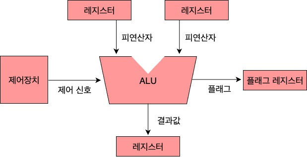

    
  

 

- **연산을 수행한 결과는 특정 숫자나 문자**, **메모리 주소**, **플래그**가 될 수 있으며 **일시적으로 레지스터에 저장**된다.
    

    
 플래그(flag)에 대해 더 자세히 
  

    > 플래그란 **연산 결과에 대한 추가적인 상태 정보**이다.  

    > 플래그들은 **플래그 레지스터**라는 레지스터에 **저장된다.**

    |플래그 종류|의미|사용 예시|
    |--|--|--|
    |부호 플래그|연산한 결과의 부호를 나타낸다.|부호 플래그가 1인 경우 계산 결과는 음수, 0일 경우 계산 결과는 양수를 의미한다.|
    |제로 플래그|연산 결과가 0인지 여부를 나타낸다.|제로 플래그가 1인 경우 연산결과는 0, 0일 경우 연산 결과는 0이 아님을 의미한다.|
    |캐리 플래그|연산 결과 올림수나 빌림수가 발생했는지를 나타낸다.|캐리 플래그가 1일 경우 올림수나 빌림수가 발생했음을 의미, 0일 경우 발생하지 않았음을 의미한다.|
    |오버플로우 플래그|오버플로우가 발생했는지를 나타낸다|오버플로우 플래그가 1일 경우 오버플로우가 발생했음을 의미, 0일 경우 발생하지 않았음을 의미한다.|
    |인터럽트 플래그|인터럽트가 가능한지를 나타낸다.|인터럽트 플래그가 1일 경우 인터럽트가 가능함을 의미하고, 0일 경우 인터럽트가 불가능함을 의미한다.|
    |슈퍼바이저 플래그|커널 모드로 실행 중인지, 사용자 모드로 실행 중인지를 나타낸다.|슈퍼바이저 플래그가 1일 경우 커널 모드로 실행 중임을 의미하고, 0일 경우 사용자 모드로 실행 중임을 의미한다.|

    
  

 

### 제어장치
- **제어 신호를 내보내고 명령어를 해석**하는 부품.  
    

    
 제어 신호란? 
  

    >제어 신호는 **컴퓨터 부품을 관리하고 작동시키기 위한 일종의 전기신호**이다.  

    >‼️ CPU 제조사마다 제어장치의 구현 방식이나 명령어를 해석하는 방식이 조금씩 상이하다.

    

    #### 제어장치가 받아들이는 정보
    - **클럭(clock) 신호**
    - 해석해야 할 **명령어**
    - 플래그 레지스터 속 **플래그 값**
    - 시스템 버스 중 **제어 버스로 전달된 제어 신호**  

        

        
 제어장치 정보의 흐름 
  

        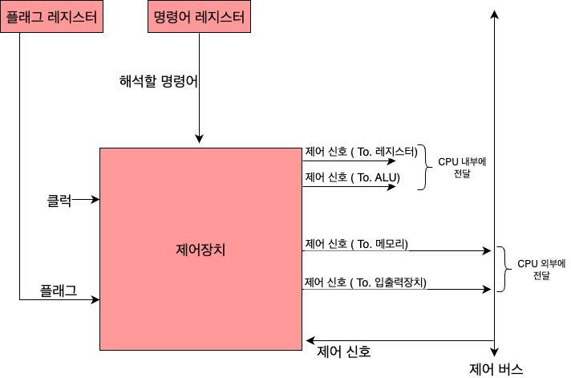

        

 

## 레지스터
### 프로그램 카운터(Program Counter)
- 메모리에서 읽어 들일 **명령어의 주소를 저장**한다.
- CPU에 따라 **명령 포인터(Instruction Pointer)** 라고도 한다.

### 명령어 레지스터(Instruction Register)
- 메모리에서 읽어 들인 **명령어를 저장**하는 레지스터.
- 제어장치는 명령어 레지스터 속 명령어를 받아들이고 해석한 뒤 제어신호를 내보낸다.

### 메모리 주소 레지스터(Memory Address Register)
- **메모리의 주소를 저장**하는 레지스터이다.
- CPU가 읽어 들이고자 하는 주소 값을 주소 버스로 보낼 때 메모리 주소 레지스터를 거치게 된다.

### 메모리 버퍼 레지스터(Memory Buffer Register)
- **메모리와 주고받을 데이터와 명령어를 저장**하는 레지스터.
- 메모리에 쓰고싶은 값이나 메모리로부터 전달받은 값은 메모리 버퍼 레지스터를 거친다.

 

 위 4개 레지스터의 동작방식 보기 
   

- CPU로 실행할 프로그램이 1000~1500번지 까지 저장되어 있고 1000번지에는 1101(2)가 저장되어 있다고 가정한다.

    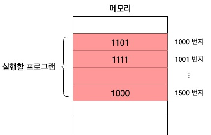  
 
- 프로그램을 처음부터 실행하기 위해 **프로그램 카운터**에는 **주소값 1000이 저장**된다. 이는 메모리에서 가져올 명령어가 1000번지에 있음을 의미한다.

    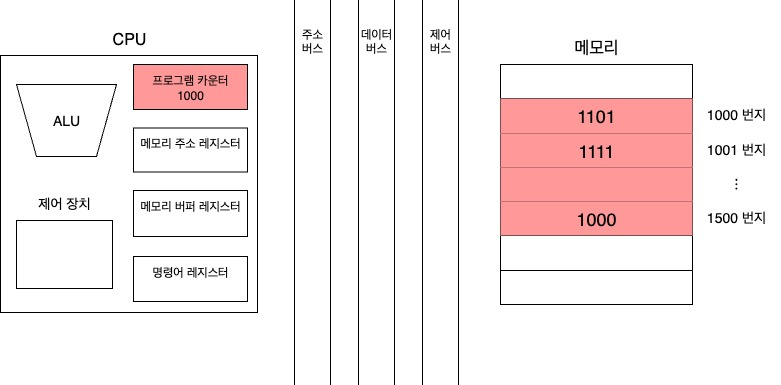   
 
- **1000번지를 읽어 들이기 위해서는 주소 버스로 1000번지를 내보내야 한다.** 이를 위해 **메모리 주소 레지스터** 에는 1000이 저장된다.

    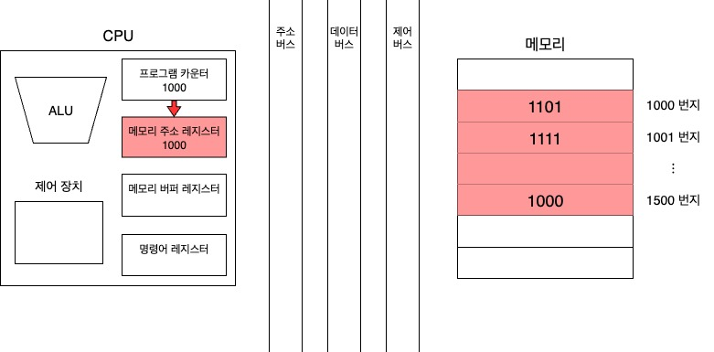  
 
- '메모리 읽기' **제어 신호와 메모리 주소 레지스터 값이 각각 제어 버스와 주소 버스를 통해 메모리로 보내진다.**

    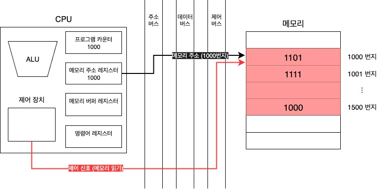  
 
- **메모리 1000번지에 저장된 값은 데이터 버스를 통해 메모리 버퍼 레지스터로 전달**되고 **프로그램 카운터는 증가**되어 다음 명령어를 받아들일 준비를 한다.

    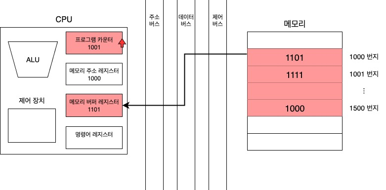  
 
- **메모리 버퍼 레지스터에 저장된 값은 명령어 레지스터로 이동**한다.

    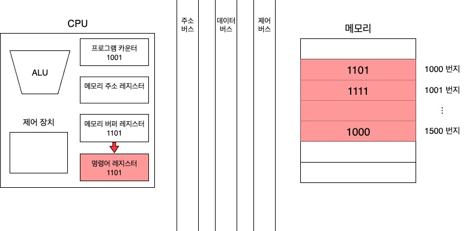  
 
- **제어장치는 명령어 레지스터의 명령어를 해석하고 제어 신호를 발생**시킨다.

    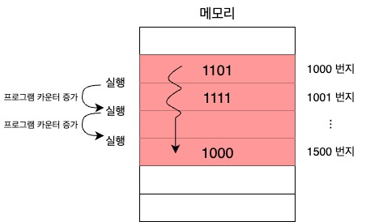  

- **프로그램 카운터는 지속적으로 증가하며 계속해서 다음 명령어를 읽어들일 준비를 한다.**
이러한 과정이 반복되며 CPU는 **프로그램을 차례대로 실행**해 나간다.

 

### 범용 레지스터(General Purpose Register)
- 다양하고 일반적인 상황에서 **자유롭게 사용 가능한 레지스터.**
- **데이터와 주소 모두 저장**할 수 있다.
- 현대 CPU 대다수에는 범용 레지스터가 있다.

### 플래그 레지스터(Flag Register)
- ALU 연산 결과에 따른 **플래그를 저장하는 레지스터.**
- 연산결과 또는 CPU 상태에 대한 부가적인 정보를 저장한다.

 

## 특정 레지스터를 이용한 주소 지정 방식
### 스택 주소 지정 방식
- **스택**과 **스택 포인터를 이용**한 주소 지정 방식.
    

    
 스택 포인터와 스택 영역에 대해 자세히 
   

    > 스택 포인터란? **스택에 마지막으로 저장한 값의 위치를 저장**하는 레지스터.
    - 스택에 3, 2, 1 순으로 입력되어 있으면 스택 포인터는 가장 마지막 값인 1의 주소인 4번지를 가리킨다.
    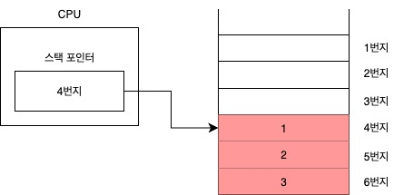 
    - 1을 꺼내면 2와 3이 남고 스택 포인터는 가장 꼭대기인 2가 있는 주소인 5번지를 가리킨다.
    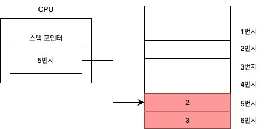 
    - 4라는 데이터가 추가되면 4번지에 데이터가 들어오게 되고 스택 포인터는 4번지를 가리킨다.
     

        > 스택 영역이란? **메모리 안에 스택처럼 사용할 수 있도록 정해진 영역**을 말한다.

        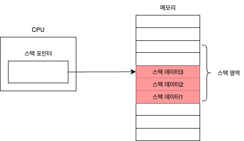

    

### 변위 주소 지정 방식
- **오퍼랜드 필드의 값(변위)과 특정 레지스터의 값을 더하여 유효 주소를 얻어내는 주소 지정 방식.**
    

    
 그림으로 보기 
 

    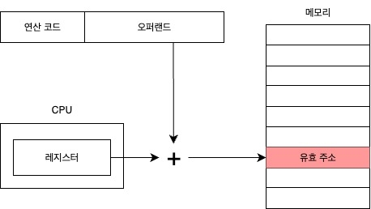

    > 변위 주소 지정 방식을 사용하는 명령어는 아래와 같이
    연산코드 필드, 레지스터 필드, 오퍼랜드 필드가 있다.

    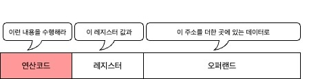

    

     

- 변위 주소 지정 방식은 오퍼랜드 필드의 주소와 어떤 레지스터를 더하는지에 따라 **상대 주소 지정 방식, 베이스 레지스터 주소 지정 방식으로 나뉜다.**

    

    
 상대 주소 지정 방식 
 

    - **오퍼랜드와 프로그램 카운터의 값을 더하여 유효 주소를 얻는 방식.**
        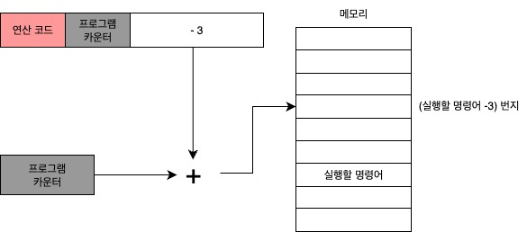
        
        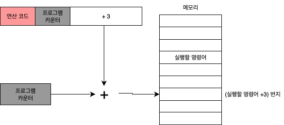
        > 프로그래밍 언어의 if문과 유사하게 **모든 코드를 실행하는 것이 아닌 분기하여 특정 주소의 코드를 실행할 때 사용**된다.
    

    

    
 베이스 레지스터 주소 지정 방식 
 

    - **오퍼랜드와 베이스 레지스터의 값을 더하여 유효 주소를 얻는 방식.**
        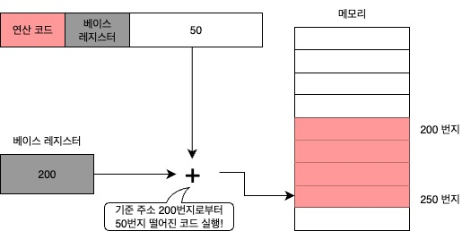
        > 베이스 레지스터는 기준 주소를 제공하고 오퍼랜드의 값을 더하여 그 값만큼 떨어진 주소에 접근한다.

    

 

## 명령어 사이클과 인터럽트
### 명령어 사이클(instruction cycle)
- 프로그램속 명령어들은 일정한 주기가 반복되며 실행되는데 이 주기를 **명령어 사이클**이라고 한다.
    

    
 명령어 사이클 과정 
 

    - **인출 사이클(fetch cycle)** 명령어를 메모리에서 CPU로 가져온다

        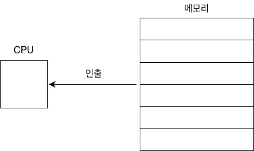

    - **실행 사이클(execution cycle)** 가져온 명령어를 해석하고 제어신호를 발생 시킴

        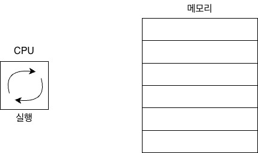

    - 위와 같이 일반적으로 인출 사이클, 실행 사이클을 반복하며 실행된다. 도식화 하면 아래와 같음

        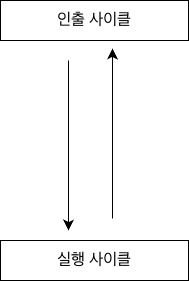

    - **간접 사이클(indirect cycle)** 간접 주소 지정방식과 같은 경우는 오퍼랜드 필드에 유효 주소의 주소를 명시하니까 바로 실행 사이클에 돌입할 수 없음.
    **메모리 접근을 한번 더** 해야하기 때문임.

        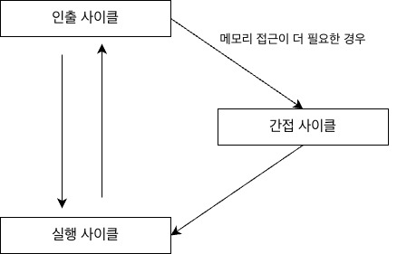

    

 

### 인터럽트(Interrupt)
- **CPU가 수행중인 작업을 중단하거나 방해하는 신호**
- interrupt는 방해하다, 중단시키다 라는 의미임

    #### 동기 인터럽트(synchronous interrupt)
    - **CPU에 의해 발생**하는 인터럽트
    - CPU가 명령어를 수행하다가 예상치 못한 상황에 마주쳤을때 발생
        (ex 프로그래밍상의 오류와 같은 예외적인 상황)
    - **[예외(Exception)](#exception)** 라고 부르기도 함

    #### 비동기 인터럽트(asynchronous interrupt)
    - **입출력 장치에 의해 발생**하는 인터럽트  
        (ex CPU가 프린터와 같은 입출력 장치에 입출력 작업을 부탁하면 작업을 끝낸 입출력 장치가 CPU에 완료 알림(인터럽트)을 보냄)
    - **하드웨어 인터럽트**라고 부르기도 함

         

        

        
 비동기(하드웨어) 인터럽트의 필요성 
 

        - 입출력 작업 도중에 CPU가 효율적으로 명령어를 처리할 수 있다.  
            (ex 프린터 출력 속도 매우 느려서 CPU는 입출력 작업 결과를 바로 받아볼 수 없음,  
            비동기 인터럽트를 전송하면 입출력 작업이 완료되었는지 주기적으로 확인할 필요가 없다.)

        

        

        
 비동기(하드웨어) 인터럽트처리 순서 
 

        1. 입출력장치는 CPU에 [인터럽트 요청 신호](#interrupt-request-signal)를 보냄
        2. CPU는 실행 사이클이 끝나고 명령어를 인출하기 전 항상 인터럽트 여부를 확인
        3. CPU는 인터럽트 요청을 확인하고 [인터럽트 플래그](#interrupt-flag)를 통해 현재 인터럽트를 받아들일 수 있는지 여부를 확인
        4. 인터럽트를 받아들일 수 있다면 CPU는 지금까지의 작업을 백업
        5. CPU는 [인터럽트 벡터](#interrupt-vector)를 참조하여 [인터럽트 서비스 루틴](#interrupt-service-routine)을 실행
        6. 인터럽트 서비스 루틴 실행이 끝나면 4에서 백업해둔 작업을 복구하여 실행을 재개

 
 
 
 
 

## 보충 이론

###  예외(Exception)
- 예외가 발생하면 CPU는 하던 일을 중단하고 해당 예외를 처리한다.
- 예외를 처리하면 CPU는 다시 본래 하던 작업으로 되돌아와 실행을 재개한다.

    #### 예외의 종류
    - **폴트(fault)**
        > 예외를 처리한 직후 예외가 발생한 명령어 부터 실행을 재개하는 예외  
    - **트랩(trap)**
        > 예외를 처리한 직후 예외가 발생한 명령어의 다음 명령어부터 실행을 재개하는 예외
    - **중단(abort)**
        > CPU가 실행 중인 프로그램을 강제로 중단시킬 수밖에 없는 심각한 오류를 발견했을 때 발생하는 예외
    - **소프트웨어 인터럽트(software interrupt)**
        > 시스템 호출이 발생했을 때 나타나는 예외 (나중에 상세히 서술)
    

###  인터럽트 요청 신호
- 인터럽트 발생을 위한 요청 신호

    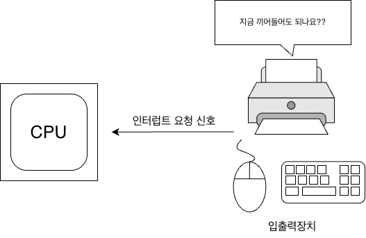

 

###  인터럽트 플래그
- 비동기 인터럽트를 받아들일지 무시할지 결정하는 플래그

    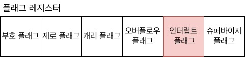

- CPU가 중요한 작업을 처리해야 하거나 어떤 방해도 받지 말아야 할 경우 인터럽트 플래그는 불가능으로 설정된다.
- 인터럽트 플래그가 불가능으로 설정 되어 있어도 무시할 수 없는 우선순위가 높은 인터럽트 요청도 있다.
    (ex 하드웨어 고장, 정전 등)

 

###  인터럽트 서비스 루틴
- 인터럽트를 처리하기 위한 프로그램으로 인터럽트 핸들러(interrupt handler)라고도 불린다.
- 인터럽트가 발생했을 때 해당 인터럽트를 어떻게 처리하고 작동해야 할지에 대한 정보로 이루어져있다.
- 인터럽트를 처리하는 방식은 입출력장치마다 달라 각기 다른 인터럽트 서비스 루틴을 가진다.

    #### 작동 방식
    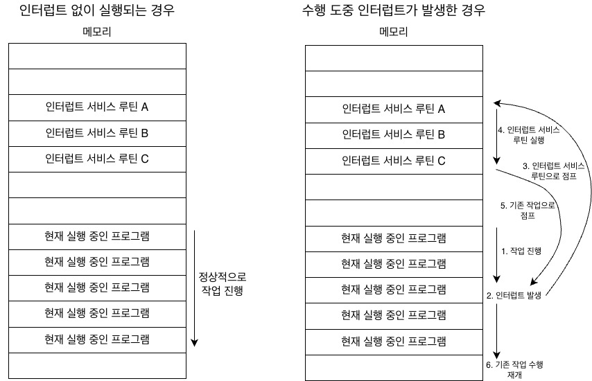
    > 위 그림을 보면 **인터럽트를 처리한다**는 말은 **인터럽트 서비스 루틴을 실행하고 본래 수행하던 작업으로 다시 돌아온다**는 말임을 알 수 있다.

     

    #### 인터럽트 발생 시 현재 작업 백업 방식
    - 인터럽트 요청을 받아들여 10번지의 인터럽트 서비스 루틴을 실행해야 한다고 가정하면
    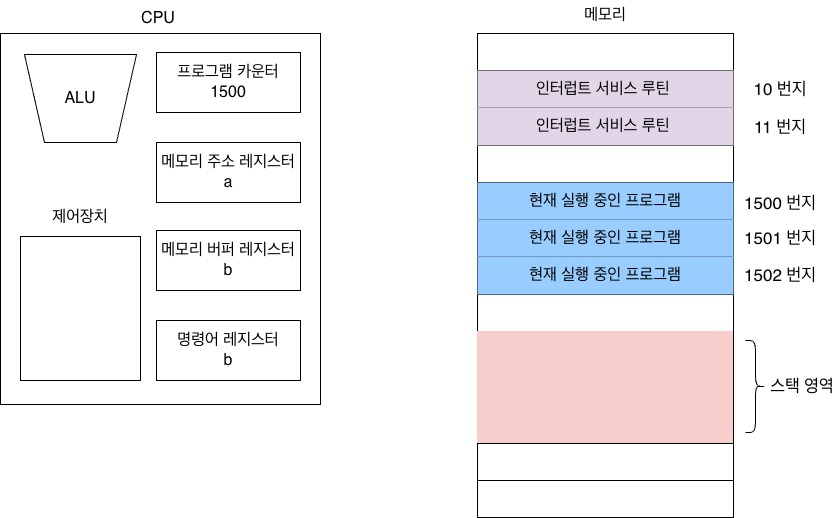

    - 아래와 같이 CPU가 실행하고 있던 카운터 값 등 현재 프로그램을 재개하기위한 모든 내용을 스택에 백업한다
    - 그리고 인터럽트 서비스 루틴의 시작 주소가 위치한 곳으로 프로그램 카운터 값을 갱신하고 인터럽트 서비스 루틴을 실행한다.
    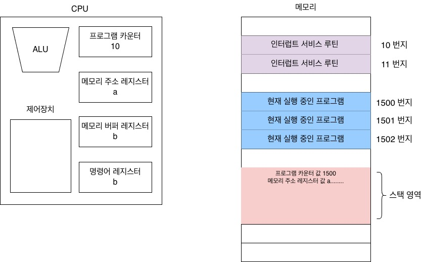
    
    - 인터럽트 사이클이 포함된 명령어 사이클은 아래와 같이 처리된다.
    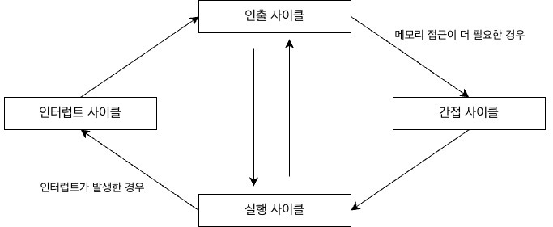

 

###  인터럽트 벡터
- 각기 다른 인터럽트 서비스 루틴을 식별하기 위한 정보
- 인터럽트 백터로 인터럽트 서비스 루틴의 시작 주소를 알 수 있다.

    #### 작동 방식
    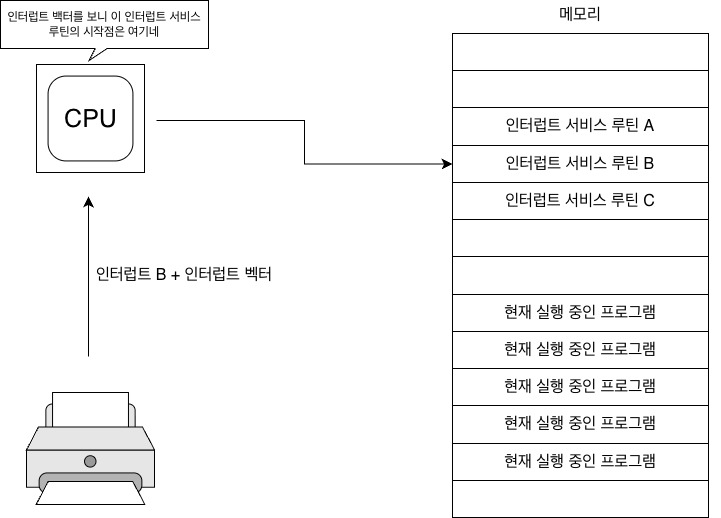