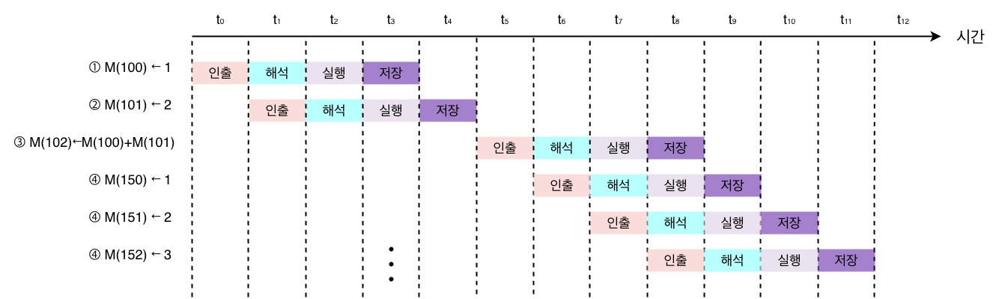
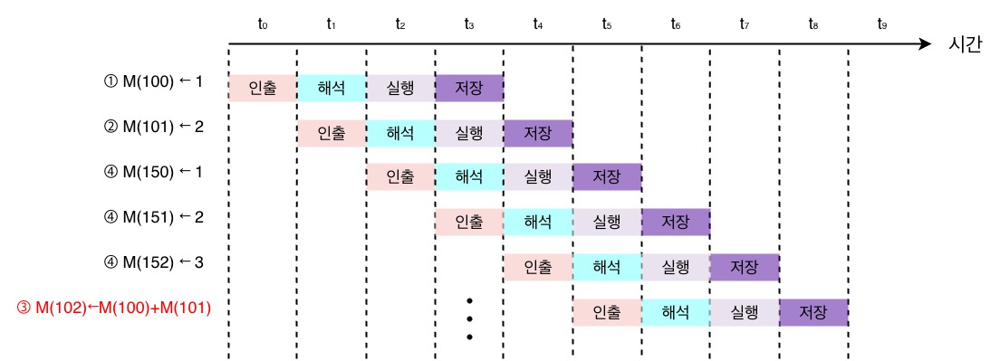
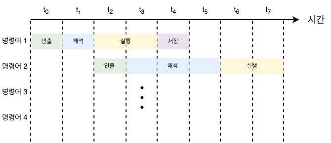

# CPU performance improvement techniques

 

## 빠른 CPU를 위한 설계 기법
### 클럭
- CPU가 **명령어를 일정한 타이밍에 맞춰 순서대로 실행하도록 기준을 제공**하는 시간 신호
- CPU는 **명령어 사이클**이라는 정해진 흐름에 맞춰 명령어들을 실행한다.
- **클럭 속도가 높아지면 CPU는 명령어 사이클을 더 빠르게 반복**한다
    

    
 클럭 속도에 대해 자세히 
 

    - 클럭 속도는 헤르츠(Hz) 단위로 측정하고 1초에 클럭이 몇번 반복되는지를 타나낸다.
        > 1초에 한번 = 1Hz  
        1초에 100번 = 100Hz
    - 클럭 속도를 높이면 CPU가 빨리지지만 발열등의 문제가 있기 때문에 클럭 속도만으로 CPU 성능을 올리는데에는 한계가 있다.

    

     

- 일반적으로 클럭 속도가 높은 CPU는 성능이 좋다.
    > 최대 클럭 속도를 강제로 끌어올리는 기법을 오버클럭킹(overclocking)이라고 한다.

 

### 코어와 멀티코어

#### 코어(Core)
- 명령어 인출-해석-실행 사이클을 독립적으로 수행할 수 있는 최소 단위이다.
    > 과거 코어1개로 이루어진 전통적 CPU는 그 자체로 CPU라고 불렸지만 현대적 관점에서 CPU는 코어 여러개를 포함하는 구조를 가진다.

#### 멀티 코어(multi-core)
- 코어를 여러개 가진 CPU
- 멀티코어 CPU, 멀티코어 프로세서 라고 불린다.
    

    
 코어 수 별 프로세서 명칭 
 

    |코어 수|프로세서 명칭|
    |--|--|
    |1|싱글코어(single-core)|
    |2|듀얼코어(dual-core)|
    |3|트리플코어(triple-core)|
    |4|쿼드코어(quad-core)|
    |6|헥사코어(hexa-core)|
    |8|옥타코어(octa-core)|
    |10|데카코어(deca-core)|
    |12|도데카코어(dodeca-core)|
    

    

    
❗ 멀티코어가 무조건 빠른건 아니다? 
 

    #### 단일 코어 클럭이 높아야 빠른 경우
    - 작업이 순차적(직렬)인 경우
    - 게임, 일반 프로그램 UI반응, 옛날 프로그램 등

    #### 멀티 코어 수가 많아야 빠른 경우
    - 작업이 병렬화 가능한 경우
    - 영상 인코딩 / 렌더링, AI / 머신러닝, 가상머신, 도커, 컴파일, 압축 / 해제, 과학 계산 / 시뮬레이션, 서버 등

        > 코어마다 처리할 명령어들을 얼마나 적절하게 분배하느냐에 따라 연산속도는 크게 달라짐

    

     

### 스레드와 멀티스레드
- 스레드의 사전적 의미는 '실행 흐름의 단위'이다.

    #### 하드웨어적 스레드
    - **하나의 코어가 동시에 처리하는 명령어 단위**
    - 하나의 코어로 여러 명령어를 동시에 처리하는 CPU를 **멀티스레드(multithread)** 또는 멀티스레드 CPU라고 한다.
        > 하이퍼스레딩(hyper-threading) - 인텔 멀티스레드 기술  
        AMD는 자가 멀티스레드 기술을 그냥 멀티스레드(SMT)라고 부름

        

        
멀티스레드에 대해 자세히 
 

        - 하나의 코어가 레지스터는 2벌(2세트)를 가지고 실행유닛을 공유하는 형태이다.
        - 두개의 명령어를 처리하기위한 정보들을 기억할 수 있고 실행유닛이 두개의 명령어가 동시에 실행된다.
            > 프로그램 입장에서는 2코어 4스레드 CPU가 논리 프로세서 4개를 가진 것처럼 보이며 이 실행단위를 **논리 프로세서(logic processor)** 라고 한다. (작업 관리자 성능탭에서 확인 가능)

        
       
        
    #### 소프트웨어적 스레드
    - **하나의 프로그램에서 독립적으로 실행되는 단위**
    - 하나의 프로그램은 실행 과정에서 한 부분만 실행될 수도 있지만, 프로그램의 여러 부분이 동시에 실행될 수도 있다.
        > 따라서 1코어 1스레드 CPU도 소프트웨어적 스레드를 수십개 실행할 수 있다.

 

## 명령어 병렬 처리 기법
- 명령어를 동시에 처리하도록 (병렬로) CPU를 작동시키는 기법

    ### 명령어 파이프라인
    - 명령어 처리 과정을 여러 단계로 나누어, 서로 다른 명령어의 서로 다른 처리 단계를
  클럭 단위로 겹쳐 수행하는 기법

        
        > 위 그림을 명령어 처리 과정을 클럭 단위로 나누었을때  
        인출 → 해석 → 실행 → 저장  
        으로 일반적으로 보면
        - t1에서 명령어 1, 2를 동시에 처리할 수 있다
        - t2에서 명령어 1, 2, 3을 동시에 처리할 수 있다.
        - 즉 서로 다른 명령어의 서로 다른 단계를 병렬로 수행할 수 있다.
    - 특정 상황에서는 성능향상에 실패하는 경우도 있는데 이런 상황을 **파이프라인 위험(pipeline hazard)** 라고 한다.
        

        
 Pipeline hazard에 대해 자세히 
 

        #### 데이터 위험(data hazard)
        - 명령어 간 '데이터 의존성'에 의해 발생  
            > ex) 이전 명령어를 끝까지 수행해야만 실행할 수 있는 명령어인 경우
        - 위와 같이 데이터 의존적인 두 명령어를 무작정 동시에 수행하려고 하면 파이프 라인이 제대로 작동하지 않는다. 이를 **데이터 위험**이라고 한다.

        #### 제어 위험(control hazard)
        - 분기 등으로 인한 프로그램 카운터의 갑작스러운 변화에 의해 발생
                
                if (x == 0)
                    A;
                else
                    B;
                C;
            > 파이프라인 기법은 명령어를 빠르게 처리하기 위해 분기 결과가 확정되기 전에 다음 실행될 명령어를 미리 인출하고 처리한다.
            하지만 if는 참 거짓에 따라 하나의 결과만 갖게 되므로 분기 결과에 따라 미리 인출되어 처리중이던 일부 명령어는 실행되지 않고 폐기된다.
            - 위와 같이 파이프라인에 미리 가져와 처리중이었던 명령어가 분기 결과에 의해 쓸모없어지는 현상을 **제어 위험**이라고 한다.
            - 프로그램이 어디로 분기할지 예측한 후 그 주소를 인출하는 기술인 **분기 예측(branch prediction)** 기법으로 제어위험을 대응할 수 있다.

        #### 구조적 위험(structural hazard)
        - 명령어들이 겹쳐 실행되는 과정에서 서로 다른 명령어가 동시에 ALU, 레지스터 등과 같은 CPU 부품을 사용하려고 할때 발생
            > ex) 같은 클럭에서 서로 다른 명령어가 같은 절차(단계)를 수행할 때 그 단계를 수행하는 자원이 부족한 경우 발생
        - **자원 위험(resource hazard)** 라고도 한다.
        

     

    ### 슈퍼스칼라
    - 코어 내부 실행 유닛(ALU, 레지스터 등 실행기)를 여러개 두어 한 클럭에 여러 명령를 병렬 실행할 수 있는 구조
    - 이론적으로 슈퍼스칼라 프로세서는 파이프라인 개수에 비례해 프로그램 처리속도가 빠르나 파이프라인 위험(pipeline hazard)을 피하기가 더욱 까다로워 반드시 빨라진다고는 할 수 없다.

     

    ### 비순차적 명령어 처리(OoOE: Out-of-order execution)
    - 명령어를 순차적으로 처리하지 않는 기법
    - 상기 파이프라이닝, 슈퍼스칼라는 순차적 처리를 상정한 방법이나 비순차적 명령어 처리는 **명령어 순서를 바꿔 실행해도 무방한 명령어를 먼저 실행하여 파이프라인이 멈추는 것을 방지하는 기법**이다.

        

        
 이해를 돕기 위한 예시 
 

        > 아래와 같은 명령어로 이루어진 소스코드가 있다고 가정하고  
        편의상 '메모리 N번지'는 **M(N)** 으로, '메모리 N번지에 M을 저장하라'는 **M(N)←M** 으로 표기한다.

            ① M(100) ← 1
            ② M(101) ← 2
            ③ M(102) ← M(100) + M(101)
            ④ M(150) ← 1
            ⑤ M(151) ← 2
            ⑥ M(152) ← 3
        > 명령어 ③을 실행하기 위해서는 ①, ②번 명령어가 실행이 끝날때 까지 기다려야 한다.  

        

        > 위 그림과 같이 명령어를 순차적으로 실행되는 CPU로 실행하면 ②번 명령어가 실행이 끝날때 까지 ③, ④, ⑤, ⑥번 명령어들은 대기한다.

            ① M(100) ← 1
            ② M(101) ← 2
            ④ M(150) ← 1
            ⑤ M(151) ← 2
            ⑥ M(152) ← 3
            ③ M(102) ← M(100) + M(101)
        > 위와 같이 ③번은 순서를 바꾸어 실행해도 크게 문제될 것 없으며 순서를 바꿔 실행하면 아래 그림과 같이 수행된다.

        

        > 위 그림을 보면 순차적으로 명령어를 수행할 때보다 효율적으로 처리가 가능하다.  
        (비순차적 명령어 처리 기법)  
        **⚠️ 순서를 바꿀 수 없는 경우를 직접 생각해보자!**

         

## CISC와 RISC
### 명령어 집합 구조 (ISA: Instruction Set Architecure)
- CPU가 이해할 수 있는 명령어들의 모음을 **명령어 집합** 또는 **명령어 집합 구조(ISA)** 라고 한다.
- CPU 제조사마다 ISA의 세세한 생김새, 연산, 주소 지정 방식등은 조금씩 차이가 있다.  

    

    
 간단한 예시 
 

    |CPU 제조사|사용 ISA|
    |--|--|
    |인텔 노트북 CPU|x86 or x86-64 ISA|
    |애플 아이폰 CPU|ARM ISA|

    

     

- ISA가 다르다는건 어셈블리어도 달라진다.
    

    
 간단한 예시 
 

    
    > 명령어의 생김새만 달라지는게 아닌 제어장치가 명령어를 해석하는 방식, 사용되는 레지스터의 종류와 개수, 메모리 관리 방법 등 많은것이 바뀌며 CPU 하드웨어 설계에도 큰 영향을 미친다.

    

     

### CISC (Complex Instruction Set Computer)
- 직역하면 '복잡한 명령어 집합을 활용하는 컴퓨터(CPU)'를 의미하고 이름 그대로 **복잡하고 다양한 명령어들을 활용하는 CPU 설계 방식**이다.
- 대표적으로 x86, x86-64가 CISC 기반의 ISA이다.
- 적은 길이의 명령어로 프로그램을 동작시킬 수 있어 **메모리 공간을 절약할 수 있다.**

    

    
 예시 
 

    
    > 보다시피 짧다. ARM

    

     

- 명령어의 크기와 실행되기까지의 시간이 일정하지 않을 수 있다. (느림)

    

    
 왜 느려질 수 있을까? 
 

   
   > 파이프라이닝을 구현하기 위해서는 가급적 1클럭으로 동일해야한다.

   
   > CISC의 경우 명령어 수행 시간이 길고 제각각이기 때문에 파이프라인이 효율적으로 명령어를 처리할 수 없다.  
   즉 규격화 되지 않은 명령어는 파이프라이닝을 어렵게 만든다.

    

     

### RISC (Reduced Instruction Set Computer)
- CISC의 한계를 극복하고자 등장한 ISA

    

    
 RISC 원칙 
 

    - 원활한 파이프라이닝을 위해 **명령어 길이와 수행시간이 짧고 규격화 되어야 한다.**
    - 복잡한 기능을 추가하기보다 자주 쓰이는 **기본적인 명령어를 작고 빠르게 만들어야 한다.**

    

     

- **짧고 규격화된 명령어**로 구성되어 있으며 **1클럭 내외로 실행되는 명령어를 지향**한다. (고정 길이 명령어)
- 파이프라이닝에 최적화 되어있다.
- CISC보다 주소 지정 방식의 종류가 적다.
    > 메모리에 직접 접근하는 명령어를 load, store 두개로 제한하여 단순화하고 최소화 시킴  
    대신 레지스터를 적극 활용해서 레지스터를 이용한 연산과 레지스터 개수가 더 많다.
    
 

### CISC / RISC 차이 단순 정리
|CISC|RISC|
|:--:|:--:|
|복잡하고 다양한 명령어|단순하고 적은 명령어|
|가변 길이 명령어|고정 길이 명령어|
|다양한 주소 지정 방식|적은 주소 지정 방식|
|프로그램을 이루는 명령어의 수가 적음|프로그램을 이루는 명령어의 수가 많음|
|여러 클럭에 걸쳐 명령어 수행|1클럭 내외로 명령어 수행|
|파이프라이닝 하기 어려움|파이프라이닝 하기 쉬움|
