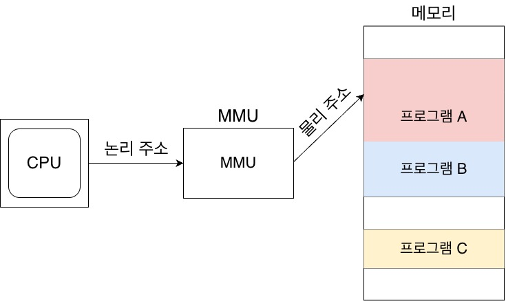
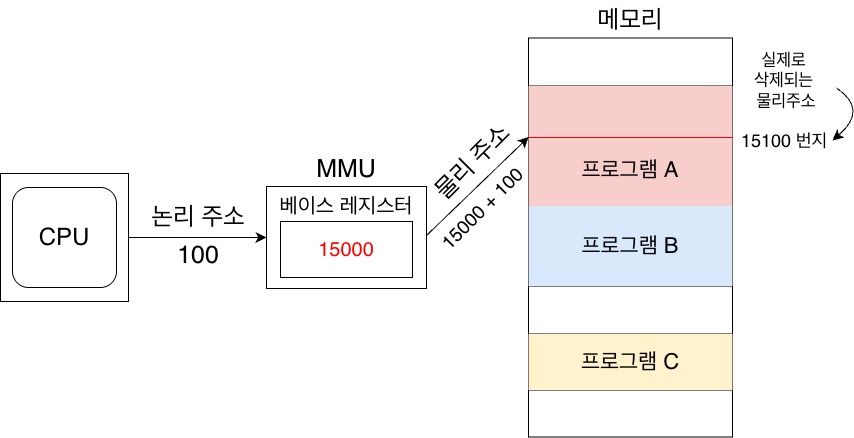
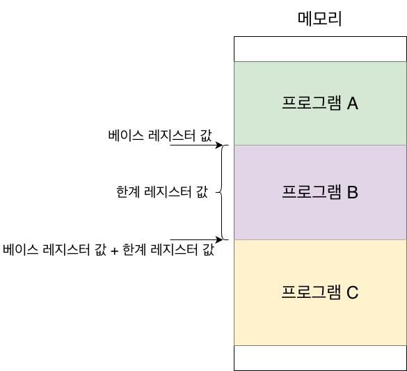
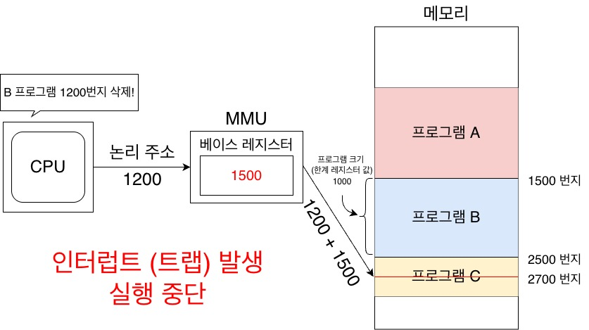
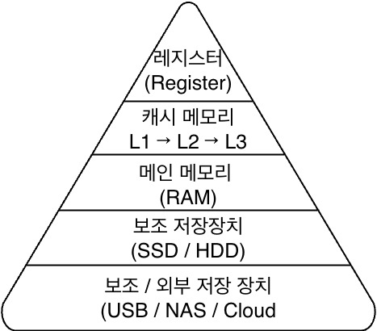
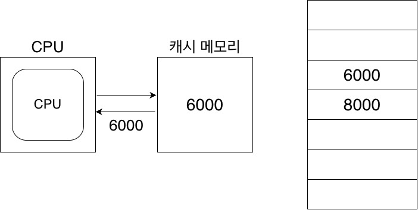
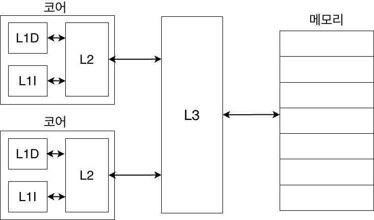

# Memory And Cache Memory

## RAM의 특징
- 전원을 끄면 저장된 명령어와 데이터가 모두 날아가는 **휘발성 저장 장치**이다.
- RAM에는 실행할 대상을 저장하고 CPU가 직접 접근하여 명령어를 실행한다.

 

## RAM의 용량과 성능
- 용량이 적으면 보조기억장치에서 필요한 프로그램을 가져오는 절차가 많아져 비교적 느리다.
- 용량이 크면 위와같은 보조기억장치에서 프로그램을 가져오는 절차가 줄어들고 동시에 많은 프로그램을 실행하는데 유리하다.
- RAM 용량이 커지면 프로그램 실행 속도가 증가하지만 필요 이상의 용량인 경우에는 프로그램 실행 속도가 크게 차이나지 않는다.

 

### RAM의 종류
#### DRAM (Dynamic RAM)
- 메인 메모리에 해당하며 실행 데이터를 저장한다.
- 저장된 데이터가 동적으로 변하는(사라지는) RAM으로 시간이 지나면 저장된 데이터가 점차 사라진다.
- 데이터의 소멸을 막기 위해 일정 주기로 데이터를 재활성화(다시 저장)해야 한다.
    > 전하가 자연적으로 새서 계속 보충(리프레시)가 필요하다는 말
- 소비 전력이 비교적 낮고 저렴하고 직접도가 높기 때문에 대용량으로 설계하기가 용이하다.
    > 집적도가 높다 = 더 작고 빽빽하게 만들 수 있다.

 

#### SDRAM(Synchronous Dynamic RAM)
- 클럭 신호와 동기화된 DRAM의 발전된 형태이다.
    > 클럭 신호에 맞춰 CPU와 정보를 주고받을 수 있다.

 

#### DDR SDRAM(Double Data Rate SDRAM)
- 대역폭을 넓혀 속도를 빠르게 만든 SDRAM의 발전된 형태이다.
    > 대역폭이란? 데이터를 주고 받는 길의 넓이
- DDR SDRAM은 한 클럭당 두번씩 CPU와 데이터를 주고받을 수 있어 SDRAM 보다 전송 속도가 두 배가량 빠르다.
- **DDR SDRAM의 종류**
    | 구분 | DDR | DDR2 | DDR3 | DDR4 | DDR5 |
    |---|---|---|---|---|---|
    | 등장 시기 | 2000 | 2003 | 2007 | 2014 | 2021 |
    | 전압 | 2.5V | 1.8V | 1.5V | 1.2V | 1.1V |
    | 기본 속도 | ~400 MT/s | ~800 MT/s | ~1600 MT/s | ~3200 MT/s | 4800~8400+ MT/s |
    | 대역폭 | 낮음 | ↑ | ↑ | ↑ | 폭증 |
    | 프리페치 | 2n | 4n | 8n | 8n | 16n |
    | 채널 구조 | 단일 | 단일 | 단일 | 단일 | 듀얼 채널 내장 |
    | 호환성 | ❌ | ❌ | ❌ | ❌ | ❌ |
    > 세대가 거듭될수록 대역폭을 크게 키우는 방향으로 발전

 

#### SRAM(Static RAM)
- PC CPU및 각종 디바이스 프로세서 등의 내부에 위치한 메모리
- DRAM 계열과 동일하게 휘발성 메모리지만 **전원이 있는 한 값이 고정(Static)되어서 리프레시(재활성화)가 필요 없다.**
- 매우 빠르게 작동하지만 직접도가 낮아 캐시에 사용된다.
    > L1 ~ L3
- SRAM / DRAM 계열 핵심 비교
    | 구분 | SRAM | DRAM |
    |---|---|---|
    | 풀네임 | Static RAM | Dynamic RAM |
    | 저장 방식 | 플립플롭(래치) | 캐패시터(전하) |
    | 리프레시 | ❌ 필요 없음 | ⭕ 필요함 |
    | 속도 | 🔥 매우 빠름 | 🐢 상대적으로 느림 |
    | 가격 | 💰 매우 비쌈 | 💸 저렴 |
    | 집적도 | 낮음 | 높음 |
    | 전력 효율 | 좋음 | 리프레시 때문에 불리 |
    | 주 사용처 | CPU 캐시 (L1~L3) | 메인 메모리 (RAM) |
    > 플립플롭(래치)  
        - 트랜지스터 여러 개로 이루어진 논리 회로
        - 0 또는 1 상태를 회로 자체가 유지

    > 캐패시터(전하)  
        - 트랜지스터 1개 + 캐패시터 1개  
        - 캐패시터에 전하가 있으면 1 없으면 0  
        - 시간이 지나면 전하가 자연히 세어나감

 

## 메모리의 주소 공간
### 물리 주소와 논리 주소
- **물리 주소(physical address)** 는 **정보가 실제로 저장된 하드웨어상 주소**를 의미한다.
    > 실제 메모리의 주소
- **논리 주소(logical address)** 는 **실행 중인 프로그램 각각에 부여된 0번지부터 시작되는 주소**를 의미한다.
    > 프로그램 / 프로그래밍 언어 상의 주소 (실제 메모리 주소가 아님)

    

    
 왜 나뉘어져 있을까? 
 

    메모리에 저장된 정보는 시시각각 변하기 때문!  
    새롭게 실행되는 프로그램이 시시때때로 적재되고 끝난 프로그램은 (메모리 상에서)삭제된다.  
    때문에 같은 프로그램을 실행 하더라도 실행할 때 마다 적재되는 주소가 달라질 수 있다.  

    

 

- **논리 주소와 물리 주소 간의 변환은** CPU와 주소 버스 사이에 위치한 **메모리 관리 장치 (MMU:Memory Management Unit)라는 하드웨어에 의해 수행**된다.
    
    

    
 논리 주소 물리 주소 변환 과정 
 

    
    > CPU가 프로그램의 논리주소를 해석 / 실행하고 MMU가 OS로 부터 물리 주소를 받아 논리 주소와 더해 메모리에 접근한다

    
    > 베이스 레지스터는 프로그램의 가장 작은 물리주소 즉 프로그램의 첫 물리주소를 저장한다.
    

 

## 메모리 보호 기법
- 메모리상 다른 프로그램이 할당된 주소 영역의 침범을 보호하기 위해 **한계 레지스터(limit register)** 가 사용된다
    

    
 한계 레지스터 작동 메커니즘 
 

    
    > B 프로그램이 총 250의 공간을 필요로 하며 실행중이고 베이스 레지스터 값이 100이라 가정했을 때 250을 초과하여 다른 프로그램의 영역을 침범하지 않도록 한계 레지스터에는 150의 값이 부여된다.

    
    > 위 그림과 같이 B 프로그램이 총 1000의 메모리 공간을 필요로 하며 베이스 레지스터 값이 1500일때 한계 레지스터 값은 1000이 부여되고 B 프로그램의 한계 레지스터 값을 초과한 논리 주소로 접근을 시도 했을 때 인터럽트(트랩)을 발생시켜 실행을 중단한다.  

    > 한계 레지스터 값은 실행중인 프로그램이 필요로하는 메모리 공간 만큼의 값이 부여됨을 알 수 있다.

    

 

## 캐시 메모리
### 저장 장치 계층 구조 (memory hierarchy)
- 컴퓨터가 사용하는 저장 장치들은 CPU에 얼마나 가까운가를 기준으로 계층적으로 나타낼 수 있다.
    

    
 저장 장치 계층 구조 그림 
 

    
    > 위로 올라 갈 수록 속도는 빠르고 용량은 적고 가격은 비싸진다.

    

     

### 캐시 메모리
- CPU와 메모리 사이에 위치하고 레지스터보다 용량이 크고 메모리보다 빠른 **SRAM기반의 저장장치**이다.
- CPU의 연산 속도와 메모리 접근 속도의 차이를 조금이나마 줄이기 위해 등장했다.
- **메모리에서 CPU가 사용할 일부 데이터를 미리 캐시 메모리로 가지고 와서 활용**한다.
    
- 캐시 메모리의 종류로는 **L1, L2, L3** 캐시 메모리가 있다
    

    
 캐시 메모리 종류 자세히 
 

   | 구분 | L1 Cache | L2 Cache | L3 Cache |
    |----|---------|---------|---------|
    | 위치 | CPU 코어 내부 | CPU 코어 내부 | CPU 다이 내부 (코어 공용) |
    | 접근 속도 | 🚀 매우 빠름 (1~4 cycle) | 🚀 빠름 (5~15 cycle) | 🚀 보통 (20~40+ cycle) |
    | 용량 | 매우 작음 (수십 KB) | 작음 (수백 KB ~ 1MB) | 큼 (수 MB ~ 수십 MB) |
    | 공유 여부 | ❌ 코어별 전용 | ❌ 코어별 전용 | ⭕ 모든 코어 공유 |
    | 구성 | I-Cache / D-Cache 분리 | 통합 캐시 | 통합 캐시 |
    | 사용 목적 | 즉시 실행 데이터 | L1 보조 | 코어 간 데이터 공유 |
    | 가격 | 💰💰💰 | 💰💰 | 💰 |
    | 구현 | SRAM | SRAM | SRAM |

    

    

    
 분리형 캐시 
 

    - L1 캐시는 접근속도를 더 방향시키기 위해 명령어만을 저장하는 L1I 캐시, 데이터만을 저장하는 L1D 캐시로 분리하는 경우도 있다.  
    이를 분리형 캐시 (split cache)라고 한다.

        

    

     

    #### 참조지역성 원리
    - 캐시 메모리는 용량이 작아 메인 메모리의 모든 내용을 복사 해올 수 없다.
    - 용량의 효율적인 사용을 위해 **CPU가 사용할 법한 대상을 예측하여 저장**한다.
        > 참조 지역성의 원리에 따라 가져올 데이터를 결정한다.
    - 자주 사용될 것으로 예측한 데이터가 실제로 들어맞아 CPU에서 활용될 경우를 **캐시 히트(cache hit)** 라고 한다.
    - 예측이 틀려 메모리에서 필요한 데이터를 직접 가져와야 하는 경우를 **캐시 미스(cache miss)** 라고 한다.
    - 캐시가 히트되는 비율을 **캐시 적중률(cache hit ratio)** 이라 하고 다음과 같이 계산한다
        > 캐시 적중률 = 캐시 히트 횟수 / (캐시 히트 횟수 + 캐시 미스 횟수)  

        >일반적으로 컴퓨터의 캐시 적중률은 85~95% 이상이다.

        #### 참조지역성 원리(locality of reference, principle of locality)
        - CPU는 최근에 접근했던 메모리 공간에 다시 접근하려는 경향이 있다.
            > 프로그래밍 언어에서 변수와 같이 선언 후 여러번 재사용되는 요소에 접근하는 것을 말함
            위와 같이 최근에 접근했던 메모리 공간에 다시 접근하려는 경향을 **시간 지역성(temporal locality)** 이라고 한다.
        - CPU는 접근한 메모리 공간 근처를 접근하려는 경향이 있다.
            > 워드 프로세서, 웹 브라우저, 게임 세가지 프로그램이 동시에 메모리에 적재되어 있다고 가정해보자
            워드 프로세서에는 자동 저장 기능, 입력 기능, 출력 기능 등 다양한 기능이 있을텐데 사용자가 워드 프로세서를 집중적으로 사용하고 있다면 CPU는 메모리의 워드 프로세서 프로그램이 모여 있는 공간 근처를 집중적으로 접근할 것 이고 사용자가 입력 기능을 사용하고 있다면 입력 기능이 모여있는 공간을 집중적으로 접근할 것 이다. 이를 **공간 지역성(spatial locality)** 라고 한다.
    