# Secondary Storage

## 다양한 보조기억장치
### 하드디스크
- **자기적인 방식으로 데이터를 저장**하는 보조기억장치로 자기 디스크(magnetic disk)라고도 불린다.
- CD나 LP와 비슷하게 동그란 원판에 데이터를 저장하고 뾰족한 리더기로 데이터를 읽는다.

    #### 하드디스크 구조
    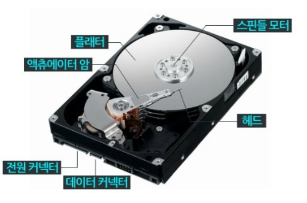
    - 플래터 (platter) - 데이터가 저장되는 공간
    - 스핀들 (spindle) - 플래터를 회전시키는 부품 분당 회전수를 RPM 단위로 나타낸다
        > RPM이 15,000인 하드 디스크는 분당 15,000바퀴를 회전한다.
    - 헤드(head) - 플래터를 대상으로 데이터를 읽고 쓰는 부품
    - 디스크 암 / 액추에이터 암 - 헤드를 원하는 위치로 이동시키는 부품

     

### 플래터의 구조와 데이터 저장 원래

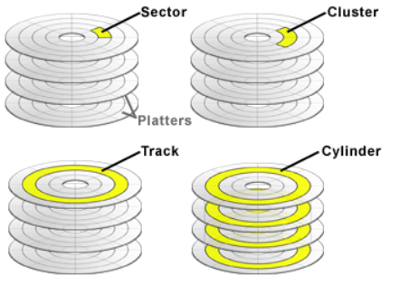
- 섹터(secter) - 트랙을 구성하는 최소 단위 (보통 512byte)
- 트랙(track) - 섹터로 구성되며 섹터가 쭉 나열되어 있는 것
- 클러스터(cluster) - 섹터로 구성되며 여러겹의 플래터 상에 같은 섹터에 위치한 곳을 모아 연결한 논리적 단위
- 실린더(cylinder) - 여러겹의 플래터 상에서 같은 트랙이 위치한 곳을 모아 연결한 논리적 단위
    > 정보는 보통 한 실린더에 기록된다.  
    ex) 두개의 플래터를 사용하는 하드디스크를 예시로 들면 네개의 섹터에 걸쳐 첫번째 플래터 윗면, 뒷면과 두번째 플래터 윗면, 뒷면에 데이터를 저장한다.

### 하드 디스크가 저장된 데이터에 접근하는 시간
- 탐색 시간(seek time) - 접근하려는 데이터가 저장된 트랙까지 헤드를 이동시키는 시간
- 회전 지연(rotational latency) - 헤드가 있는 곳으로 플래터를 회전 시키는 시간
- 전송 시간(transfer time) - 하드 디스크와 컴퓨터 간에 데이터를 전송하는 시간

    > 스핀들의 RPM을 올려서 속도를 높일 수 도 있지만  
    참조 지역성, 즉 접근하려는 데이터가 플래터 혹은 헤드를 조금만 옮겨도 접근할 수 있는 곳에 위치해 있는것도 중요하다.

    #### 단일 헤드 디스크와 고정 헤드 디스크
    - 단일 헤드 디스크(single-head disk) - 플래터 한 면당 하나의 헤드가 달려있는 하드 디스크, 이동 헤드 디스크라고도 불린다
    - 고정 헤드 디스크(fixed-head disk) - 트랙마다 헤드가 있어서 탐색 시간이 0이다, 다중 헤드 디스크라고도 불린다.

 

### 플래시 메모리(flash memory)
- 대표적으로 USB 메모리, SD카드, SSD가 플래시 메모리 기반 보조기억장치이다.
    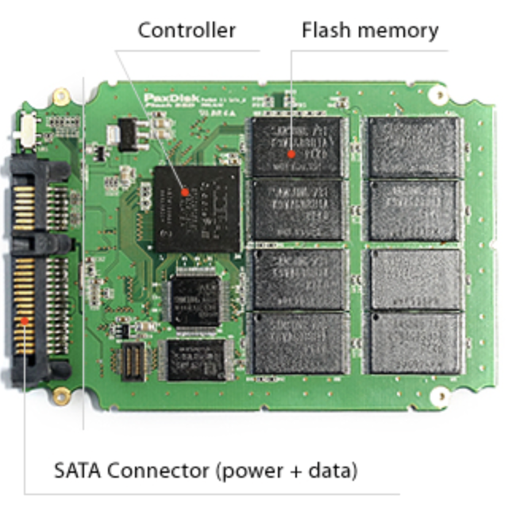
    > SSD의 플래시 메모리 사진
- 전기적으로 데이터를 읽고 쓸 수 있는 반도체 기반의 저장 장치이다.
- ROM에도 사용되고 일상적으로 접하는 거의 모든 전자제품 안에 플래시 메모리가 내장되어 있는 경우가 많다.
- 셀(cell) 이라는 메모리에서 데이터를 저장하는 가장 작은 단위로 구성되어있다.
    
 
    
플래시 메모리의 종류

    #### NAND 플래시 메모리
    - NAND 연산을 수행하는 회로 기반
    - 직렬 형태로 데이터를 쓰고 읽음
    #### NOR 플래시 메모리
    - NOR 연산을 수행하는 회로 기반
    - 병렬 형태로 데이터를 쓰고 읽음

    | 구분 | NAND Flash | NOR Flash |
    |----|-----------|-----------|
    | 연결 구조 | 직렬 구조 | 병렬 구조 |
    | 접근 방식 | 블록 단위 순차 접근 | 주소 기반 직접 접근 |
    | 읽기 속도 | 상대적으로 느림 | 빠름 |
    | 쓰기 속도 | 빠름 | 느림 |
    | 수정(Overwrite) | 느림 (블록 단위 erase 필요) | 상대적으로 빠름 |
    | 용량 확장 | 쉬움 (고집적 가능) | 어려움 |
    | 회로 복잡도 | 단순 | 복잡 |
    | 가격 | 저렴 | 비쌈 |
    | 주 사용처 | SSD, USB, SD카드, 스마트폰 저장소 | BIOS, 펌웨어, 임베디드 코드 |

    

 

### 셀 타입별 플래시 메모리 종류
#### SLC 타입
- 한 셀에 1비트를 저장할 수 있다 (1과 0 두개의 정보를 표현 가능)
- MLC나 TLC 타입에 비해 비트의 빠른 입출력이 가능하다
- MLC나 TLC 타입에 비해 수명이 길다 (수십만~수백만 가까지 쓰고 지우기 가능)
- 용량대비 가격이 높은 단점이 있다

 

#### MLC 타입
- 한 셀에 2비트를 저장할 수 있다 (00, 01, 10, 11 네개의 정보 표현)
- SLC 타입보다 일반적으로 속도와 수명이 낮다
- SLC 타입보다 대용량화가 유리하다 (2비트)
- SLC 타입보다 가격이 저렴하다
- 시중에 사용되는 많은 플래시 메모리 저장 장치들은 MLC, TLC 타입인 경우가 많다.

#### TLC 타입
- 한 셀에 3비트를 저장할 수 있다 (000,001,010.... 총 여덟개 정보 저장 가능)
- SLC, MLC 타입보다 일반적으로 수명과 속도가 낮다
- 용량대비 가격이 저렴하다

    
 
    
타입별 차이 표로 보기

    | 구분 | SLC | MLC | TLC | QLC |
    |---|---|---|---|---|
    | 풀네임 | Single-Level Cell | Multi-Level Cell | Triple-Level Cell | Quad-Level Cell |
    | 셀당 비트 수 | 1 bit | 2 bit | 3 bit | 4 bit |
    | 전압 상태 수 | 2 | 4 | 8 | 16 |
    | 내구성(수명, P/E Cycle) | 🔥 매우 높음 (~100,000) | 높음 (~10,000) | 보통 (~3,000) | 낮음 (~1,000 이하) |
    | 읽기 속도 | 🔥🔥🔥 매우 빠름 | 빠름 | 보통 | 느림 |
    | 쓰기 속도 | 🔥🔥🔥 매우 빠름 | 빠름 | 느림 | 🐢 매우 느림 |
    | 오류 발생률 | 매우 낮음 | 낮음 | 보통 | 높음 |
    | 용량 대비 가격 | 💰💰💰 매우 비쌈 | 💰 비쌈 | 💸 저렴 | 💸💸 매우 저렴 |
    | 집적도(용량 확장) | 매우 낮음 | 낮음 | 높음 | 🔥 매우 높음 |
    | 주 사용처 | 산업용, 서버 캐시 | 엔터프라이즈 SSD | 일반 소비자 SSD | 대용량 SSD, 아카이브 |

    
 

     

### 플래시 메모리 구성 단위와 작동방식
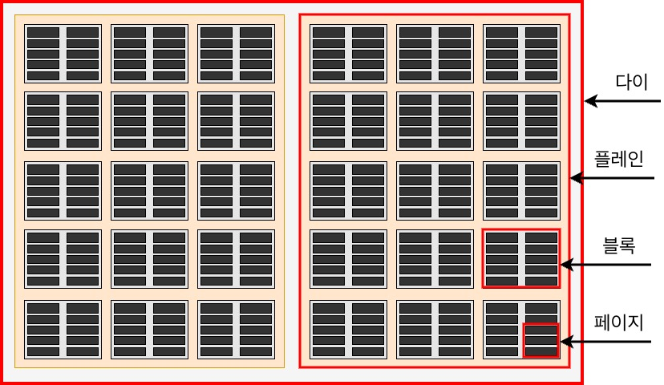
#### 셀(Cell)
- 타입에 따라 1~4bit 저장
- 가장 작은 단위라 CPU나 컨트롤러가 직접 다루지 않음

#### 페이지(Page)
- **컨트롤러가 읽기, 쓰기를 하는 최소 단위**
- 셀 여러 개가 모여서 페이지 1개를 이룸

    
 
    
페이지 하나당 몇개의 셀이 들어갈까?

    NAND 기준 대략 데이터영역 크기만 4~16KB
    페이지가 16KB라고 했을 때 TLC(셀당 3bit) 기준으로  
    16KB = 16 × 1024 × 8 = 131,072 bit
    131,072 ÷ 3 ≈ 약 43,690 셀  
    (대략적 수치니 참고만...)

    
 

 

#### 블록(Block)
- **삭제(erase)가 가능한 최소 단위**
- 페이지 여러 개가 모여 블록 1개를 구성
- 데이터를 블록 단위로 통째로 삭제한다

#### 플레인(Plane)
- 블록 여러개가 모인 단위

#### 다이(die)
- 플레인 여러개가 모인 단위

#### 플래시 메모리의 동작 방식
- **블록 단위로 삭제**가 이루어진다.
- **페이지 단위로 읽기 쓰기**가 이루어진다.

    
 
    
페이지의 상태

    - Free - 어떠한 데이터도 저장하고 있지 않아 **새로운 데이터를 저장할 수 있는 상태**
    - Valid - 이미 **유효한 데이터를 저장하고 있는 상태**
    - Invalid - **유효하지 않은 데이터(쓰레기값)를 저장하고 있는 상태**  
    > 하드 디스크와 달리 덮어쓰기가 불가능하며 Valid 상태인 페이지에는 새 데이터를 저장할 수 없다.

    
 

 

- **쓰기 동작의 경우**
    > X라는 블록이 네개의 페이지로 구성되어있다 가정

    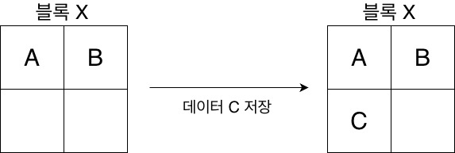
    - 위 그림과 같이 페이지 단위로 저장된다.

- **수정 하는 경우**
    > X라는 블록이 네개의 페이지로 구성되어있다 가정  
    B, C 데이터는 남겨두고 A 데이터를 A'로 수정한다면

    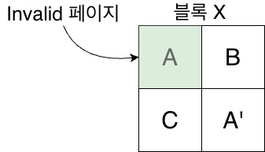
    - 위와 같이 A 데이터는 Invalid 상태(쓰레기값)가 되며 새로운 A' 데이터가 저장된다. (플래시 메모리는 덮어쓰기 불가능)
    - 즉 쓰레기값이 생기며 용량낭비를 발생시킨다.

- **가비지 컬렉션(garbage collection)**
    > X, Y라는 블록이 네개의 페이지로 구성되어있다 가정 

    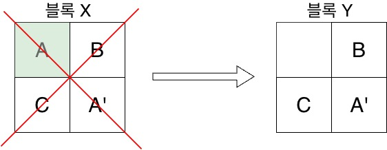
    - 쓰레기 값을 정리하기위한 기능
    - **위와 같이 유효한 페이지로 구성된 새로운 블록(Y)에 데이터를 복사하고 기존 블록(X)은 삭제하는 방식**으로 작동한다.

 

## RAID의 정의와 종류
### RAID(Redundant Array of Independent Disks)의 정의
- 데이터의 안정성 혹은 높은 성을을 위해 여러 개의 물리적 보조기억장치를 마치 하나의 논리적 보조기억장치처럼 사용하는 기술
- HDD와 SDD를 사용한다

 

### RAID의 종류
- 다양한 RAID 구성 방법을 RAID 레벨 이라고 표현한다.
- 가장 대중적인 RAID 0 ~ 6이 있고 파생형인 RAID 10, 50등이 있다.

### RAID 레벨
#### RAID 0
- 여러 개의 보조기억장치에 데이터를 단순히 나누어 저장하는 구성 방식
- 위와 같은 기법을 스트라이핑이라고 한다.
    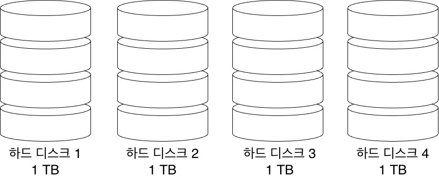

    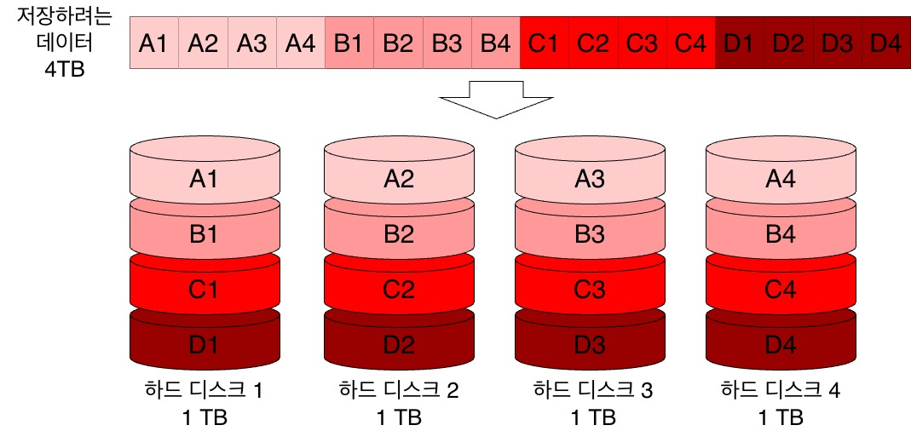
    > 위 사진과 같이 하나의 큰 프로그램의 데이터를 분산 저장하는 방식이다.

    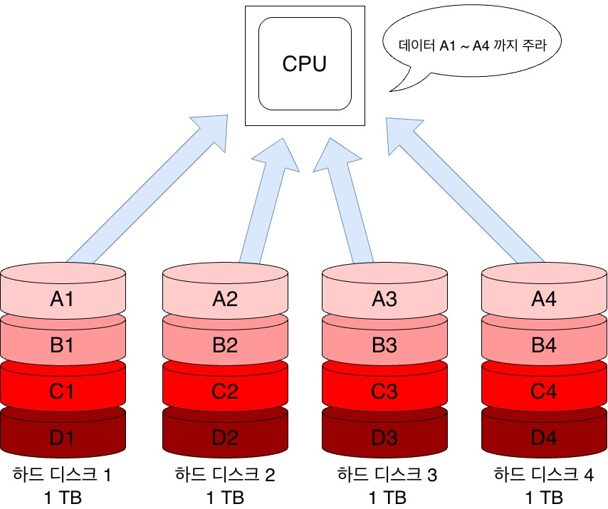
    > 하나의 저장 장치를 이용했을때와 비교하면 4개의 저장장치가 동시에 읽고 쓰기 때문에 빠르다.

    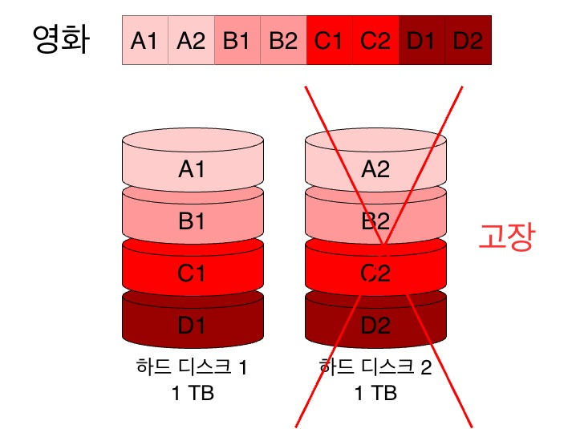
    > 단점으로 RAID 0으로 구성된 하드디스크 중 하나가 문제가 생기면 다른 하드디스크의 정보를 읽는 데 문제가 생긴다
    (데이터를 분산 저장 하기 때문에 일부 데이터 손실이 발생)

 

#### RAID 1
- RAID0에 미러링(mirroring) 기법을 적용한 방식
- 거울처럼 완전한 복사본을 만들어 두는 방식을 미러링이라고 한다.
- 데이터 복구가 매우 간단하며 하나에 문제가 발생해도 잃어버린 정보를 금방 되찾을 수 있다. (백업본이 있으니까)
- 하드디스크 개수가 한정되었을 때 사용가능한 용량이 적어지는 단점이 있다.  
(1TB HDD 4개의 경우 RAID 0은 4TB 사용, RAID 1은 2TB 사용가능)
    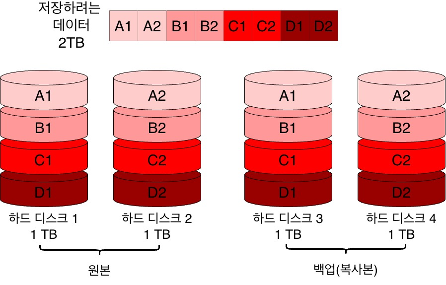
    > 위 그림과 같이 한쪽은 스트라이핑으로 저장  
    한쪽은 그와 동일한 복사본이 저장되는 방식

 

#### RAID 2
- 해밍코드(hamming code)를 이용한 방식
- ECC(error correcting code)를 저장하기 위한 별도의 디스크를 둔다
- 오류 검출(패리티) 및 수정까지 가능하여 비트 일부가 깨져도 복구가 가능하다.
- 스트라이핑이 비트 단위로 되어있고 (해밍코드 기능을 위해) 때문에 디스크가 항상 동시에 동작해야한다.

 

#### RAID 3
- ECC 기반 비트 오류 수정 기능을 빼고 패리티 기반이 디스크 단위 복구로 단순화한 방식
- byte 단위 스트라이핑으로 여전히 작은 데이터에 모든 디스크가 동원된다.
- 패리티 정보 저장용 디스크 1개만 두기 때문에 RAID2 에 비해 저장 효율이 크게 향상

 

#### RAID 4
- RAID 3와 같이 패리티 기반 방식
- 블록 단위 스트라이핑으로 병렬 처리가 가능함
- 패리티를 저장한 장치를 이용해 다른 장치의 오류를 검출하고 복구할 수 있다 (블록 단위)
- RAID 1대비 적은 하드 디스크로 데이터를 안전하게 보관할 수 있다
    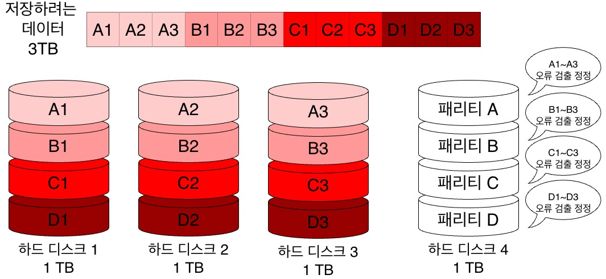
    > 위와 같이 별도의 패리티 정보 저장용 디스크를 하나 둔다

    > 새로운 데이터가 저장될 때 페리티를 저장하는 디스크에도 데이터를 쓰게 되므로 패리티 데이터를 저장하는 장치에 병목 현상이 발생할 수 있다.

 

#### RAID 5
- RAID 4의 페리티 정보 저장용 디스크의 병목현상을 해결하기 위해 등장
- 패리티 정보를 각 디스크에 분산하여 저장하는 방식
    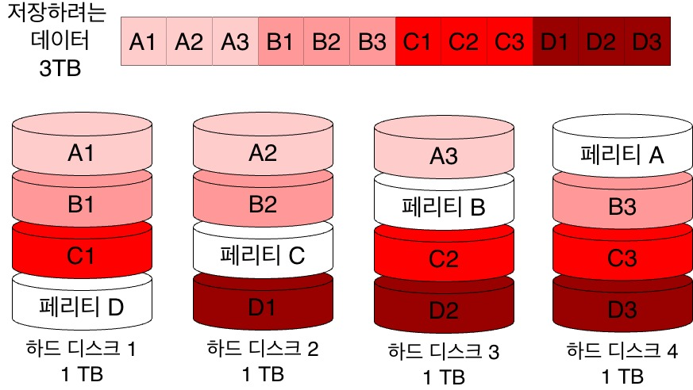

#### RAID 6
- RAID 5와 같이 패리티 정보를 분산저장하는 방식이며 2개의 패리티 정보를 저장한다. (RAID 5보다 더 안전)
- 저장할 패리티 정보가 두 개 이므로 쓰기 속도는 상대적으로 느리다
    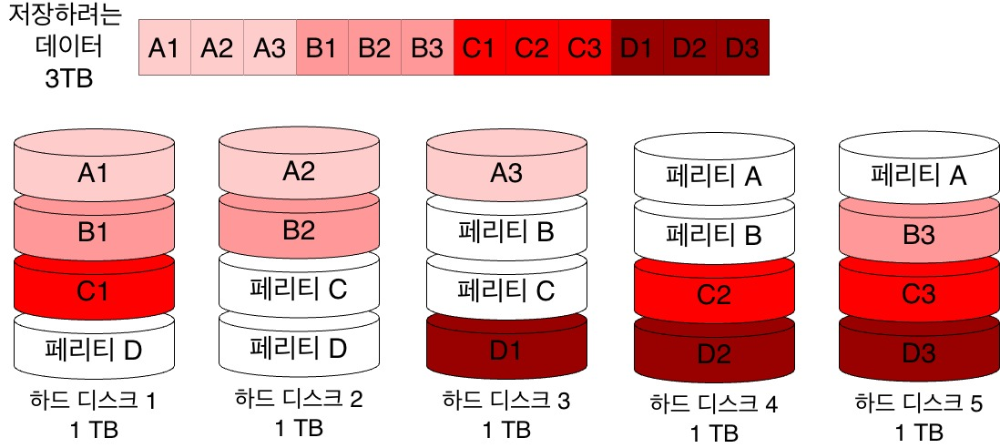

 

#### RAID 10 / RAID 50
- RAID 10은 RAID 0과 RAID 1을 혼합한 방식
- RAID 50은 RAID 0과 RAID 5를 혼합한 방식
    > 위와 같이 여러 RAID 레벨을 혼합한 방식은 Nested RAID라고 한다.